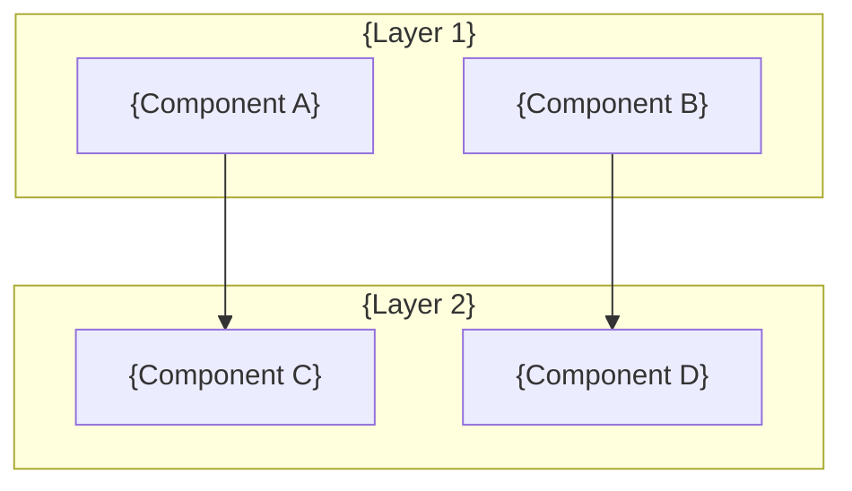
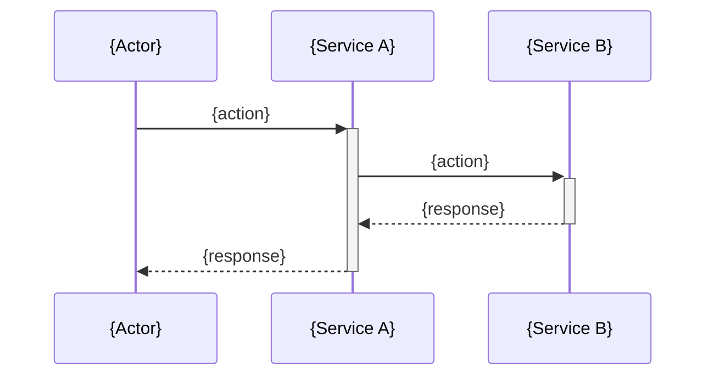

## Overview Page Template (wiki/overview.md)

```
---
title: "{Project Name}"
description: "High-level overview of the project"
category: "root"
source_files: []
created: "{date}"
last_updated: "{date}"
---

# {Project Name}

{One paragraph describing what the project does and why it exists.}

## Key Features

- {Feature 1}
- {Feature 2}

## Tech Stack

| Layer | Technology |
|-------|-----------|
| Language | {lang} |
| Framework | {framework} |
| Database | {db} |

## System Overview

```mermaid
graph TD
    {Component A} --> {Component B}
    {Component B} --> {Component C}
```

{One-line explanation of the diagram above.}

## Project Structure

{Brief directory tree with one-line descriptions}

## Quick Links

- [Architecture](./architecture.md)
- [Getting Started](./getting-started.md)
- [Glossary](./glossary.md)
```

## Architecture Page Template (wiki/architecture.md)

```
---
title: "Architecture"
description: "System architecture and design decisions"
category: "root"
source_files: []
created: "{date}"
last_updated: "{date}"
---

# Architecture

## Overview

{High-level architecture description.}

## Component Diagram



{Explanation of component relationships.}

## Data Flow



{Explanation of the data flow.}

## Key Design Decisions

### {Decision 1}
- **Context**: {why}
- **Decision**: {what}
- **Consequences**: {tradeoffs}
```

## Module Page Template (wiki/modules/*.md)

```
---
title: "{Module Name}"
description: "{One-line description}"
category: "modules"
source_files:
  - "{path/to/file}"
created: "{date}"
last_updated: "{date}"
---

# {Module Name}

## Purpose

{What this module does and why it exists.}

## Key Files

| File | Role |
|------|------|
| `{file}` | {role} |

## Public API

{Exported functions, classes, types with brief descriptions}

## Dependencies

```mermaid
graph LR
    ThisModule["{Module Name}"] --> {Dep 1}
    ThisModule --> {Dep 2}
    {Dep 3} --> ThisModule
```

- Internal: {links to other module pages}
- External: {key packages used}

## Usage Example

{Real code example from the codebase}
```

## Component Page Template (wiki/components/*.md)

```
---
title: "{Component Name}"
description: "{One-line description}"
category: "components"
source_files:
  - "{path/to/file}"
created: "{date}"
last_updated: "{date}"
---

# {Component Name}

## Purpose

{What this component does}

## Props / Interface

| Prop | Type | Required | Description |
|------|------|----------|-------------|
| {prop} | {type} | {yes/no} | {desc} |

## Usage

{Real usage example from codebase}

## Related

- {links to related components or modules}
```

## API Page Template (wiki/api/*.md)

```
---
title: "{API Section}"
description: "{One-line description}"
category: "api"
source_files:
  - "{path/to/routes}"
created: "{date}"
last_updated: "{date}"
---

# {API Section}

## Endpoints

### {METHOD} {path}

**Description**: {what it does}

**Request**: {params, body, headers}

**Response**: {response shape}

**Source**: `{file:line}`
```

## Getting Started Template (wiki/getting-started.md)

```
---
title: "Getting Started"
description: "Setup instructions and first steps"
category: "root"
source_files: []
created: "{date}"
last_updated: "{date}"
---

# Getting Started

## Prerequisites

- {prerequisite 1}

## Installation

{Step by step setup from README, package.json, Makefile}

## Running Locally

{How to start in development mode}

## Project Conventions

{Key conventions a new developer should know}
```
